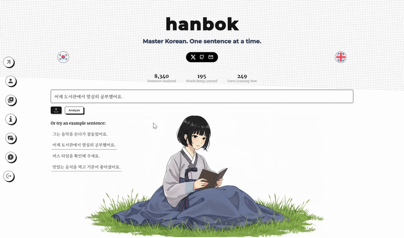

# Hanbok

[Visit Hanbok](https://hanbokstudy.com)

Originally a Korean language learning app, Hanbok is now a general purpose language learning tool that supports:

- Korean
- Japanese
- Chinese
- Spanish
- Italian
- French
- German
- Dutch
- Russian
- Turkish

## Features

- Sentence analysis
- Word analysis
- Grammar analysis
- Cultural analysis
- Image analysis
- Text to speech
- Vocabulary builder
- Cultural insights

## Demo

### Basic Sentence Analysis

Break down sentences into their components to understand grammar patterns, vocabulary, and usage.

### Image Text Extraction

Extract and analyze text from images to learn from real-world materials.

## Roadmap

Exciting new features coming soon:

- Spaced Repetition Flashcards
- Interactive Grammar Exercises  
- Structured Daily Lessons
- Real-time Voice Conversation Practice
- Typing practice for different languages
